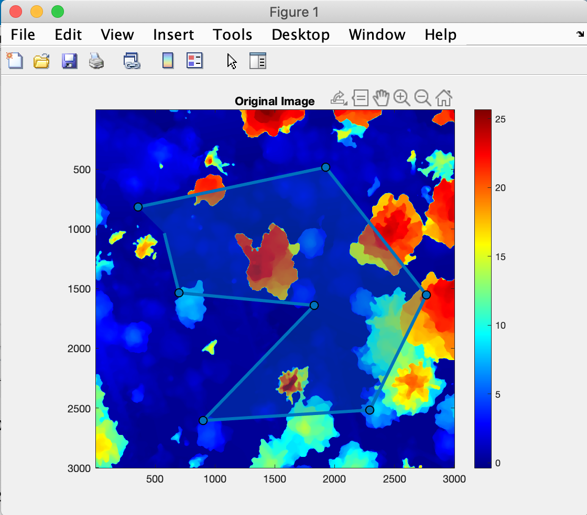

# Matlab orthophoto cropping tool

cropAnyShape.m

(c) Felix Leidinger, 2020
 
This function crops a georeferenced input image to an arbitrary shape and returns the
cropped image, the polyshape, mask and the updated spatial reference.

# Usage

Input args:
* img - anydimensional image array
* H - 3x3 homography for spatial reference of img
* geometry - char, providing options for image cropping:
            'p' : Polygon (interactive)
            'r' : Rectangle (interactive)
            'c' : Circle (interactive)
            'e' : Ellipse (interactive)
            'f' : Freehand (interactive)
          - 2x2 Bounding box array [xmin xmax; ymin ymax]

Output args:
* img_crop_big - Input image, set to zero outside the crop shape
* img_crop_small - Input image, cropped to bounding box of the crop shape
* mask_crop_big - Logical crop mask inside input image
* mask_crop_small - Logical crop mask, cropped to bounding box of the crop shape (Alpha) 
* H_crop - Updated 3x3 homography for spatial reference of the cropped bounding box
* bb_crop_I - 2x2 Bounding box array [xmin xmax; ymin ymax] of intrinsic coordinates (PX)
* bb_crop_E - 2x2 Bounding box array [xmin xmax; ymin ymax] of extrinsic coordinates (World)
* worldFile - imref2d object of input image
* worldFile_crop - imref2d object of cropped image




# Repo structure

```
.
|-- README.md
|-- cropAnyShape.m
|-- how_to_use.m
|-- multichannel.mat
`-- screenshot.png

0 directories, 6 files


This tree was created by the following command:
work@leidix:~$ tree --dirsfirst --charset=ascii .
```

